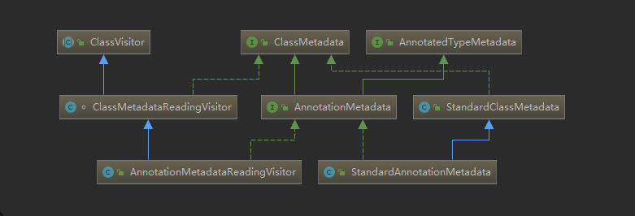

# Spring注解驱动

## Spring注解

https://github.com/spring-projects/spring-framework/wiki/Spring-Annotation-Programming-Model

Meta-Annotations

`org.springframework.stereotype.Component`

Stereotype Annotations

`org.springframework.stereotype.Repository`

`org.springframework.stereotype.Service`

`org.springframework.stereotype.Controller`

`org.springframework.context.annotation.Configuration`


`org.springframework.context.annotation.ClassPathBeanDefinitionScanner`处理

`Component`、`Repository`、`Service`、`Controller`

`org.springframework.context.annotation.ClassPathScanningCandidateComponentProvider#registerDefaultFilters`注册`org.springframework.core.type.filter.TypeFilter`

```java
protected void registerDefaultFilters() {
    //注册Spring的
   this.includeFilters.add(new AnnotationTypeFilter(Component.class));
   ClassLoader cl = ClassPathScanningCandidateComponentProvider.class.getClassLoader();
   try {
         //注册JSR-250的
      this.includeFilters.add(
          new AnnotationTypeFilter(((Class<? extends Annotation>)
           ClassUtils.forName("javax.annotation.ManagedBean", cl)), false));
   }
  
   try {
         //注册JSR-330的
      this.includeFilters.add(new AnnotationTypeFilter(
            ((Class<? extends Annotation>) ClassUtils.forName("javax.inject.Named", cl)), false));
      
   }
}
```

org.springframework.context.annotation.ClassPathBeanDefinitionScanner#doScan()

```java
protected Set<BeanDefinitionHolder> doScan(String... basePackages) {
   Assert.notEmpty(basePackages, "At least one base package must be specified");
   Set<BeanDefinitionHolder> beanDefinitions = new LinkedHashSet<>();
   for (String basePackage : basePackages) {
       //找到待注册的Component
      Set<BeanDefinition> candidates = findCandidateComponents(basePackage);
      for (BeanDefinition candidate : candidates) {
         ScopeMetadata scopeMetadata = this.scopeMetadataResolver.resolveScopeMetadata(candidate);
         candidate.setScope(scopeMetadata.getScopeName());
         String beanName = this.beanNameGenerator.generateBeanName(candidate, this.registry);
         if (candidate instanceof AbstractBeanDefinition) {
            postProcessBeanDefinition((AbstractBeanDefinition) candidate, beanName);
         }
         if (candidate instanceof AnnotatedBeanDefinition) {
            AnnotationConfigUtils.processCommonDefinitionAnnotations((AnnotatedBeanDefinition) candidate);
         }
         if (checkCandidate(beanName, candidate)) {
             //包装为BeanDefinitionHolder
            BeanDefinitionHolder definitionHolder = new BeanDefinitionHolder(candidate, beanName);
            definitionHolder =
                  AnnotationConfigUtils.applyScopedProxyMode(scopeMetadata, definitionHolder, this.registry);
            beanDefinitions.add(definitionHolder);
            //注册
            registerBeanDefinition(definitionHolder, this.registry);
         }
      }
   }
   return beanDefinitions;
}
```

## AnnotationMetadata

> Interface that defines abstract access to the annotations of a specific class, in a form that does not require that class to be loaded yet.



反射实现`org.springframework.core.type.StandardAnnotationMetadata`

ASM实现`org.springframework.core.type.classreading.AnnotationMetadataReadingVisitor`

## `Configuration`处理

`org.springframework.context.annotation.ConfigurationClassPostProcessor`

1. `org.springframework.context.annotation.ConfigurationClassPostProcessor#postProcessBeanDefinitionRegistry`

2. `org.springframework.context.annotation.ConfigurationClassPostProcessor#postProcessBeanFactory`

```java
public void postProcessBeanDefinitionRegistry(BeanDefinitionRegistry registry) {
   int registryId = System.identityHashCode(registry);
   if (this.registriesPostProcessed.contains(registryId)) {
      throw new IllegalStateException(
            "postProcessBeanDefinitionRegistry already called on this post-processor against " + registry);
   }
   if (this.factoriesPostProcessed.contains(registryId)) {
      throw new IllegalStateException(
            "postProcessBeanFactory already called on this post-processor against " + registry);
   }
   this.registriesPostProcessed.add(registryId);

    //ConfigurationClassParser处理
   processConfigBeanDefinitions(registry);
}
```

- `org.springframework.context.annotation.ConfigurationClass`

- `org.springframework.context.annotation.ConfigurationClassParser`

`org.springframework.context.annotation.ConfigurationClassParser#doProcessConfigurationClass`

`ConfigurationClass` ->`SourceClass` 包装

  ```java
protected final SourceClass doProcessConfigurationClass(ConfigurationClass configClass, SourceClass sourceClass)throws IOException {

    // Recursively process any member (nested) classes first
    //处理成员类
    processMemberClasses(configClass, sourceClass);

    // Process any @PropertySource annotations
    //处理@PropertySource
    for (AnnotationAttributes propertySource : AnnotationConfigUtils.attributesForRepeatable(
        sourceClass.getMetadata(), PropertySources.class,
        org.springframework.context.annotation.PropertySource.class)) {
        if (this.environment instanceof ConfigurableEnvironment) {
            processPropertySource(propertySource);
        }
    }

    // Process any @ComponentScan annotations
    // 处理 @ComponentScan 
    Set<AnnotationAttributes> componentScans = AnnotationConfigUtils.attributesForRepeatable(
        sourceClass.getMetadata(), ComponentScans.class, ComponentScan.class);
    if (!componentScans.isEmpty() &&
        !this.conditionEvaluator.shouldSkip(sourceClass.getMetadata(), ConfigurationPhase.REGISTER_BEAN)) {
        for (AnnotationAttributes componentScan : componentScans) {
            // The config class is annotated with @ComponentScan -> perform the scan immediately
            Set<BeanDefinitionHolder> scannedBeanDefinitions =
                this.componentScanParser.parse(componentScan, sourceClass.getMetadata().getClassName());
            // Check the set of scanned definitions for any further config classes and parse recursively if needed
            for (BeanDefinitionHolder holder : scannedBeanDefinitions) {
                BeanDefinition bdCand = holder.getBeanDefinition().getOriginatingBeanDefinition();
                if (bdCand == null) {
                    bdCand = holder.getBeanDefinition();
                }
                if (ConfigurationClassUtils.checkConfigurationClassCandidate(bdCand, this.metadataReaderFactory)) {
                    parse(bdCand.getBeanClassName(), holder.getBeanName());
                }
            }
        }
    }

    // Process any @Import annotations
    // 处理 @Import 
    processImports(configClass, sourceClass, getImports(sourceClass), true);

    // Process any @ImportResource annotations
    // 处理 @ImportResource 
    AnnotationAttributes importResource =
        AnnotationConfigUtils.attributesFor(sourceClass.getMetadata(), ImportResource.class);
    if (importResource != null) {
        String[] resources = importResource.getStringArray("locations");
        Class<? extends BeanDefinitionReader> readerClass = importResource.getClass("reader");
        for (String resource : resources) {
            String resolvedResource = this.environment.resolveRequiredPlaceholders(resource);
            configClass.addImportedResource(resolvedResource, readerClass);
        }
    }

    // Process individual @Bean methods
    // 处理  @Bean 
    Set<MethodMetadata> beanMethods = retrieveBeanMethodMetadata(sourceClass);
    for (MethodMetadata methodMetadata : beanMethods) {
        configClass.addBeanMethod(new BeanMethod(methodMetadata, configClass));
    }

    // Process default methods on interfaces
    processInterfaces(configClass, sourceClass);

    // Process superclass, if any
    if (sourceClass.getMetadata().hasSuperClass()) {
        String superclass = sourceClass.getMetadata().getSuperClassName();
        if (superclass != null && !superclass.startsWith("java") &&
            !this.knownSuperclasses.containsKey(superclass)) {
            this.knownSuperclasses.put(superclass, configClass);
            // Superclass found, return its annotation metadata and recurse
            return sourceClass.getSuperClass();
        }
    }

    // No superclass -> processing is complete
    return null;
}
  ```

```java
public void postProcessBeanFactory(ConfigurableListableBeanFactory beanFactory) {
   int factoryId = System.identityHashCode(beanFactory);
   if (this.factoriesPostProcessed.contains(factoryId)) {
      throw new IllegalStateException(
            "postProcessBeanFactory already called on this post-processor against " + beanFactory);
   }
   this.factoriesPostProcessed.add(factoryId);
   if (!this.registriesPostProcessed.contains(factoryId)) {
      // BeanDefinitionRegistryPostProcessor hook apparently not supported...
      // Simply call processConfigurationClasses lazily at this point then.
      processConfigBeanDefinitions((BeanDefinitionRegistry) beanFactory);
   }

   //用CGLIB提升被@Configuration标注的类ConfigurationClassEnhancer处理
   enhanceConfigurationClasses(beanFactory);
   beanFactory.addBeanPostProcessor(new ImportAwareBeanPostProcessor(beanFactory));
}
```


## `Condition`条件装配

`org.springframework.context.annotation.Condition`

注解`org.springframework.context.annotation.Conditional`

条件上下文`org.springframework.context.annotation.ConditionContext`

条件处理类`org.springframework.context.annotation.ConditionEvaluator`

```java
public boolean shouldSkip(@Nullable AnnotatedTypeMetadata metadata, @Nullable ConfigurationPhase phase) {
   if (metadata == null || !metadata.isAnnotated(Conditional.class.getName())) {
      return false;
   }

   if (phase == null) {
      if (metadata instanceof AnnotationMetadata &&
            ConfigurationClassUtils.isConfigurationCandidate((AnnotationMetadata) metadata)) {
         return shouldSkip(metadata, ConfigurationPhase.PARSE_CONFIGURATION);
      }
      return shouldSkip(metadata, ConfigurationPhase.REGISTER_BEAN);
   }

   List<Condition> conditions = new ArrayList<>();
    //取出元信息里面的Condition
   for (String[] conditionClasses : getConditionClasses(metadata)) {
      for (String conditionClass : conditionClasses) {
         Condition condition = getCondition(conditionClass, this.context.getClassLoader());
         conditions.add(condition);
      }
   }

   AnnotationAwareOrderComparator.sort(conditions);

    //匹配
   for (Condition condition : conditions) {
      ConfigurationPhase requiredPhase = null;
      if (condition instanceof ConfigurationCondition) {
         requiredPhase = ((ConfigurationCondition) condition).getConfigurationPhase();
      }
      if ((requiredPhase == null || requiredPhase == phase) && !condition.matches(this.context, metadata)) {
         //未匹配到
         return true;
      }
   }

   return false;
}
```