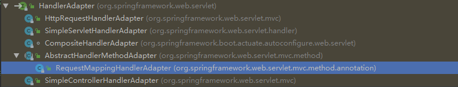
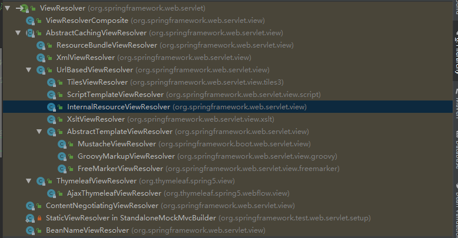
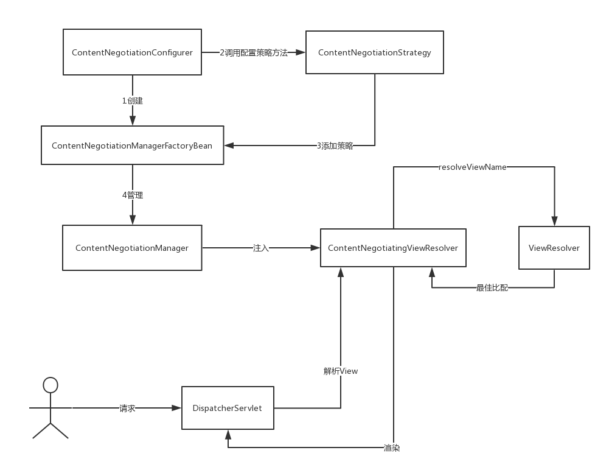
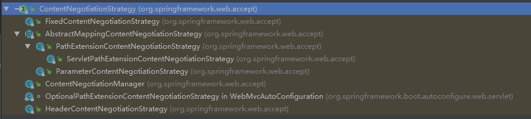
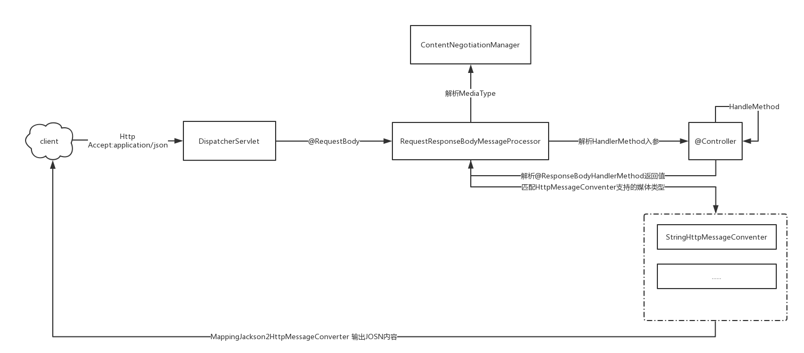

# SpringMVC

## Servlet 

### 生命周期

**Servlet**

初始化`javax.servlet.Servlet#init`

服务`javax.servlet.Servlet#service`

销毁`javax.servlet.Servlet#destroy`

**Filter**

初始化`javax.servlet.Filter#init`

处理请求`javax.servlet.Filter#doFilter`

销毁`javax.servlet.Filter#destroy`

**ServletContext**

初始化`javax.servlet.ServletContextListener#contextInitialized`

销毁`javax.servlet.ServletContextListener#contextDestroyed`

### Servlet 3.0前

组件

- `javax.servlet.Servlet`

- `javax.servlet.Filter`

上下文

- `javax.servlet.ServletContext`

- `javax.servlet.ServletRequest`
  - `javax.servlet.http.HttpServletRequest`

- `javax.servlet.ServletResponse`
  - `javax.servlet.http.HttpServletResponse`
- `javax.servlet.http.HttpSession`
- `javax.servlet.http.Cookie`

配置

- `javax.servlet.ServletConfig`
- `javax.servlet.FilterConfig`

输入输出

- `javax.servlet.ServletInputStream`
- `javax.servlet.ServletOutputStream`

异常

- `javax.servlet.ServletException`

事件/监听器

- `javax.servlet.ServletContextEvent`/`javax.servlet.ServletContextListener`
- `javax.servlet.ServletRequestEvent`/`javax.servlet.ServletRequestListener`
- `javax.servlet.http.HttpSessionEvent`/(`javax.servlet.http.HttpSessionListener`/`javax.servlet.http.HttpSessionIdListener`)
- `javax.servlet.ServletContextAttributeEvent`/`javax.servlet.ServletContextAttributeListener`
- `javax.servlet.ServletRequestAttributeEvent`/`javax.servlet.ServletRequestAttributeListener`
- `javax.servlet.http.HttpSessionBindingEvent`/(`javax.servlet.http.HttpSessionBindingListener`/`javax.servlet.http.HttpSessionAttributeListener`)

### Servlet 3.0后

注解驱动

- `javax.servlet.annotation.WebServlet`
- `javax.servlet.annotation.WebFilter`
- `javax.servlet.annotation.WebListener`
- `javax.servlet.annotation.WebInitParam`
- `javax.servlet.annotation.ServletSecurity`
- `javax.servlet.annotation.HttpMethodConstraint`
- `javax.servlet.annotation.HttpConstraint`
- `javax.servlet.annotation.HandlesTypes`

上下文

- `javax.servlet.AsyncContext`

事件/监听器

- `javax.servlet.AsyncEvent`/`javax.servlet.AsyncListener`

组件注册

- servlet
  - `javax.servlet.ServletContext#addServlet`
  - `javax.servlet.ServletRegistration`
- filter
  - `javax.servlet.ServletContext#addFilter`
  - `javax.servlet.FilterRegistration`
- listener
  - `javax.servlet.ServletContext#addListener`

装配

- `javax.servlet.ServletContainerInitializer`


## SpringMVC


### 配置

XML/编程式

https://docs.spring.io/spring/docs/5.1.4.RELEASE/spring-framework-reference/web.html#mvc-servlet-context-hierarchy

XML

基于`javax.servlet.ServletContextListener`和`Servlet`生命周期实现

`org.springframework.web.context.ContextLoaderListener`

```java
public void contextInitialized(ServletContextEvent event) {
    initWebApplicationContext(event.getServletContext());
}

public WebApplicationContext initWebApplicationContext(ServletContext servletContext) {
    ...
    if (this.context == null) {
        this.context = createWebApplicationContext(servletContext);
    }
    if (this.context instanceof ConfigurableWebApplicationContext) {
		...
    }
    servletContext.setAttribute(
        WebApplicationContext.ROOT_WEB_APPLICATION_CONTEXT_ATTRIBUTE, this.context);
    ...
}
```

DisPatcherServlet初始化过程

```sequence
Participant HttpServlet
Participant HttpServletBean
Participant FrameworkServlet
Participant DispatcherServlet
HttpServlet -> HttpServletBean:init()
HttpServletBean -> FrameworkServlet:initServletBean()
FrameworkServlet -> FrameworkServlet:initWebApplicationContext()
FrameworkServlet->DispatcherServlet: onRefresh()
DispatcherServlet->DispatcherServlet:initStrategies()
```

```java
protected final void initServletBean() throws ServletException {
    ...
    this.webApplicationContext = initWebApplicationContext();
    ...
}
protected WebApplicationContext initWebApplicationContext() {
    //获取父上下文
    WebApplicationContext rootContext =
        WebApplicationContextUtils.getWebApplicationContext(getServletContext());
    WebApplicationContext wac = null;
	...
    if (!this.refreshEventReceived) {
		//手动刷新
        onRefresh(wac);
    }
	...
    return wac;
}
```

编程式

基于`javax.servlet.ServletContainerInitializer`和`javax.servlet.annotation.HandlesTypes`实现。

- `org.springframework.web.WebApplicationInitializer`
  - `org.springframework.web.servlet.support.AbstractDispatcherServletInitializer`
  - `org.springframework.web.servlet.support.AbstractAnnotationConfigDispatcherServletInitializer`

### 流程


组件

| Bean                     | 说明                                                         |
| ------------------------ | ------------------------------------------------------------ |
| HandlerMapping           | 映射请求(request)到请求处理器（handler）                     |
| HandlerAdapter           | 帮助DispatcherServlet调用请求处理器（handler），无需关注其中实际的调用细节。 |
| HandlerExceptionResolver | 处理异常                                                     |
| ViewResolver             | 解析视图                                                     |
| LocaleResolver           | 国际化                                                       |
| ThemeResolver            | 解析主题                                                     |
| MultipartResolver        | 解析多部分请求（文件上传）的抽象                             |
| FlashMapManager          | 存储和检索“输入”和“输出”FlashMap                             |

```java
protected void doDispatch(...) throws Exception {
    HttpServletRequest processedRequest = request;
    HandlerExecutionChain mappedHandler = null;
    boolean multipartRequestParsed = false;
    //异步管理
    WebAsyncManager asyncManager = WebAsyncUtils.getAsyncManager(request);

    //视图
    ModelAndView mv = null;
    //错误
    Exception dispatchException = null;

    //是否是MultipartRequest
    processedRequest = checkMultipart(request);
    multipartRequestParsed = (processedRequest != request);

    // Determine handler for the current request.
    // 根据Handlermapping获取HandlerExecutionChain
    mappedHandler = getHandler(processedRequest);
    //没有匹配到HandlerExecutionChain
    if (mappedHandler == null) {
        noHandlerFound(processedRequest, response);
        return;
    }
    // Determine handler adapter for the current request.
    // 获取HandlerAdapter
    HandlerAdapter ha = getHandlerAdapter(mappedHandler.getHandler());
    ...
    // 执行
    mv = ha.handle(processedRequest, response, mappedHandler.getHandler());
    ...
    //处理视图
    processDispatchResult(...);
}
```

**mappedHandler = getHandler(processedRequest)**

```java
protected HandlerExecutionChain getHandler(...) throws Exception {
    if (this.handlerMappings != null) {
        for (HandlerMapping hm : this.handlerMappings) {
            ...
            //获取HandlerExecutionChain
            HandlerExecutionChain handler = hm.getHandler(request);
            if (handler != null) {
                return handler;
            }
        }
    }
    return null;
}

public final HandlerExecutionChain getHandler(...) throws Exception {
    Object handler = getHandlerInternal(request);
    if (handler == null) {
        handler = getDefaultHandler();
    }
    if (handler == null) {
        return null;
    }
    // Bean name or resolved handler?
    if (handler instanceof String) {
        String handlerName = (String) handler;
        handler = obtainApplicationContext().getBean(handlerName);
    }

    //获取HandlerExecutionChain
    HandlerExecutionChain executionChain = getHandlerExecutionChain(handler, request);
    ...
    return executionChain;
}
protected HandlerExecutionChain getHandlerExecutionChain(...) {
    //处理handler
    HandlerExecutionChain chain = (handler instanceof HandlerExecutionChain ?
                                   (HandlerExecutionChain) handler : new HandlerExecutionChain(handler));
	//找到路径，组装路径对应的Interceptor
    String lookupPath = this.urlPathHelper.getLookupPathForRequest(request);
    for (HandlerInterceptor interceptor : this.adaptedInterceptors) {
        if (interceptor instanceof MappedInterceptor) {
            MappedInterceptor mappedInterceptor = (MappedInterceptor) interceptor;
            if (mappedInterceptor.matches(lookupPath, this.pathMatcher)) {
                chain.addInterceptor(mappedInterceptor.getInterceptor());
            }
        }
        else {
            chain.addInterceptor(interceptor);
        }
    }
    return chain;
}
```

 **HandlerAdapter ha = getHandlerAdapter(mappedHandler.getHandler())**

```java
protected HandlerAdapter getHandlerAdapter(Object handler) throws ServletException {
    if (this.handlerAdapters != null) {
        for (HandlerAdapter ha : this.handlerAdapters) {
            if (logger.isTraceEnabled()) {
                logger.trace("Testing handler adapter [" + ha + "]");
            }
            //匹配handler的HandlerAdapter
            if (ha.supports(handler)) {
                return ha;
            }
        }
    }
    throw new ServletException("No adapter for handler [" + handler +
                               "]: The DispatcherServlet configuration needs to include a HandlerAdapter that supports this handler");
}
```

 **mv = ha.handle(processedRequest, response, mappedHandler.getHandler())**

策略模式 根据不同的HandlerAdaper 执行不同的handle方法。

- `org.springframework.web.servlet.HandlerAdapter`
  - `org.springframework.web.servlet.mvc.method.AbstractHandlerMethodAdapter`
    - `org.springframework.web.servlet.mvc.method.annotation.RequestMappingHandlerAdapter`
  - `org.springframework.web.servlet.mvc.HttpRequestHandlerAdapter`
  - `org.springframework.web.servlet.mvc.SimpleControllerHandlerAdapter`
  - `org.springframework.web.servlet.handler.SimpleServletHandlerAdapter`



最常用的`org.springframework.web.servlet.mvc.method.annotation.RequestMappingHandlerAdapter`

 **processDispatchResult(...)**

```java
private void processDispatchResult(...) throws Exception {

    boolean errorView = false;
    //处理异常
    if (exception != null) {
        if (exception instanceof ModelAndViewDefiningException) {
            logger.debug("ModelAndViewDefiningException encountered", exception);
            mv = ((ModelAndViewDefiningException) exception).getModelAndView();
        }
        else {
            Object handler = (mappedHandler != null ? mappedHandler.getHandler() : null);
            mv = processHandlerException(request, response, handler, exception);
            errorView = (mv != null);
        }
    }

    // Did the handler return a view to render?
    if (mv != null && !mv.wasCleared()) {
        //渲染视图
        render(mv, request, response);
        if (errorView) {
            WebUtils.clearErrorRequestAttributes(request);
        }
    }
    else {
        if (logger.isDebugEnabled()) {
            logger.debug("Null ModelAndView returned to DispatcherServlet with name '" + getServletName() +
                         "': assuming HandlerAdapter completed request handling");
        }
    }

    if (WebAsyncUtils.getAsyncManager(request).isConcurrentHandlingStarted()) {
        // Concurrent handling started during a forward
        return;
    }

    //处理 org.springframework.web.servlet.HandlerInterceptor#afterCompletion
    if (mappedHandler != null) {
        mappedHandler.triggerAfterCompletion(request, response, null);
    }
}

protected void render(...) throws Exception {
    // Determine locale for request and apply it to the response.
    //国际化处理
    Locale locale =
        (this.localeResolver != null ? this.localeResolver.resolveLocale(request) : request.getLocale());
    response.setLocale(locale);

    View view;
    String viewName = mv.getViewName();
    if (viewName != null) {
        // We need to resolve the view name.
        //根据视图名字解析
        view = resolveViewName(viewName, mv.getModelInternal(), locale, request);
		...
    }
    else {
        // No need to lookup: the ModelAndView object contains the actual View object.
        view = mv.getView();
        ...
    }
    ...
    if (mv.getStatus() != null) {
        response.setStatus(mv.getStatus().value());
    }
    //渲染
    view.render(mv.getModelInternal(), request, response);
    ...
}
protected View resolveViewName(...) throws Exception {

    if (this.viewResolvers != null) {
        for (ViewResolver viewResolver : this.viewResolvers) {
            View view = viewResolver.resolveViewName(viewName, locale);
            if (view != null) {
                return view;
            }
        }
    }
    return null;
}
```

解析视图 

- `org.springframework.web.servlet.ViewResolver`
  - `org.springframework.web.servlet.view.ViewResolverComposite`
  - `org.springframework.web.servlet.view.AbstractCachingViewResolver`
    - `org.springframework.web.servlet.view.UrlBasedViewResolver`
  - `org.springframework.web.servlet.view.ContentNegotiatingViewResolver`
  - `org.springframework.web.servlet.view.BeanNameViewResolver`




### 视图处理

内容协商



```sequence
participant ContentNegotiationConfigurer
participant ContentNegotiationManagerFactoryBean
participant ContentNegotiationStrategy
participant ContentNegotiationManager
participant ContentNegotiatingViewResolver
ContentNegotiationConfigurer -> ContentNegotiationManagerFactoryBean:关联
ContentNegotiationConfigurer -> ContentNegotiationStrategy:配置策略
ContentNegotiationStrategy -> ContentNegotiationManagerFactoryBean:注入策略
ContentNegotiationManagerFactoryBean -> ContentNegotiationManager:创建
ContentNegotiationManager -> ContentNegotiatingViewResolver:注入
```

`org.springframework.web.accept.ContentNegotiationStrategy`



```java
public View resolveViewName(String viewName, Locale locale) throws Exception {
    RequestAttributes attrs = RequestContextHolder.getRequestAttributes();
    Assert.state(attrs instanceof ServletRequestAttributes, "No current ServletRequestAttributes");
    //获取请求中的MediaType
    List<MediaType> requestedMediaTypes = getMediaTypes(((ServletRequestAttributes) attrs).getRequest());
    if (requestedMediaTypes != null) {
        //找到合适的视图候选
        List<View> candidateViews = getCandidateViews(viewName, locale, requestedMediaTypes);
        //选出最优视图
        View bestView = getBestView(candidateViews, requestedMediaTypes, attrs);
        if (bestView != null) {
            return bestView;
        }
    }
   ...
}
```

### REST处理

```sequence
participant HandlerAdapter
participant AbstractHandlerMethodAdapter
participant RequestMappingHandlerAdapter
participant ServletInvocableHandlerMethod
participant HandlerMethodReturnValueHandler
participant InvocableHandlerMethod
participant HandlerMethodArgumentResolver
HandlerAdapter -> AbstractHandlerMethodAdapter:handle()
AbstractHandlerMethodAdapter -> RequestMappingHandlerAdapter:handleInternal()
RequestMappingHandlerAdapter ->> RequestMappingHandlerAdapter:invokeHandlerMethod()
RequestMappingHandlerAdapter -->ServletInvocableHandlerMethod:createInvocableHandlerMethod()
ServletInvocableHandlerMethod ->> ServletInvocableHandlerMethod:invokeAndHandle()
ServletInvocableHandlerMethod -> InvocableHandlerMethod:invokeForRequest()
InvocableHandlerMethod -> HandlerMethodArgumentResolver:resolveArgument()
HandlerMethodArgumentResolver -->> InvocableHandlerMethod:return
InvocableHandlerMethod ->> InvocableHandlerMethod:doInvoke()
InvocableHandlerMethod -->> ServletInvocableHandlerMethod:return
ServletInvocableHandlerMethod -> HandlerMethodReturnValueHandler:handleReturnValue()
ServletInvocableHandlerMethod -->> RequestMappingHandlerAdapter:return
RequestMappingHandlerAdapter --> AbstractHandlerMethodAdapter:return
AbstractHandlerMethodAdapter -->> HandlerAdapter:return
```

```java
public void invokeAndHandle(...) throws Exception {
    //处理请求
    Object returnValue = invokeForRequest(webRequest, mavContainer, providedArgs);
    ...

    //处理返回结果
    this.returnValueHandlers.handleReturnValue(
    returnValue, getReturnValueType(returnValue), mavContainer, webRequest);
}
```

```java
public Object invokeForRequest(...) throws Exception {
    //解析参数
    Object[] args = getMethodArgumentValues(request, mavContainer, providedArgs);
    ...
    // 利用反射执行Controller方法
    Object returnValue = doInvoke(args);
    ...
    return returnValue;
}
private Object[] getMethodArgumentValues(...) throws Exception {

    MethodParameter[] parameters = getMethodParameters();
    Object[] args = new Object[parameters.length];
    //解析参数
    for (int i = 0; i < parameters.length; i++) {
        MethodParameter parameter = parameters[i];
        parameter.initParameterNameDiscovery(this.parameterNameDiscoverer);

        args[i] = resolveProvidedArgument(parameter, providedArgs);
        if (args[i] != null) {
            continue;
        }
        if (this.argumentResolvers.supportsParameter(parameter)) {

            args[i] = this.argumentResolvers.resolveArgument(
                parameter, mavContainer, request, this.dataBinderFactory);
            continue;
            ...
        }
        ...
    }
    return args;
}
public Object resolveArgument(...) throws Exception {

    //选择HandlerMethodArgumentResolver
    HandlerMethodArgumentResolver resolver = getArgumentResolver(parameter);
    if (resolver == null) {
        throw new IllegalArgumentException("Unknown parameter type [" + parameter.getParameterType().getName() + "]");
    }
    //解析参数
    return resolver.resolveArgument(parameter, mavContainer, webRequest, binderFactory);
}
```

```java
public void handleReturnValue(...) throws Exception {
    //选择HandlerMethodReturnValueHandler
    HandlerMethodReturnValueHandler handler = selectHandler(returnValue, returnType);
    if (handler == null) {
        throw new IllegalArgumentException("Unknown return value type: " + returnType.getParameterType().getName());
    }
    //处理返回结果
    handler.handleReturnValue(returnValue, returnType, mavContainer, webRequest);
}
```

解析参数/处理返回值接口

- `org.springframework.web.method.support.HandlerMethodArgumentResolver`
  - `org.springframework.web.method.support.HandlerMethodArgumentResolverComposite`

- `org.springframework.web.method.support.HandlerMethodReturnValueHandler`
  - `org.springframework.web.method.support.HandlerMethodReturnValueHandlerComposite`

内容协商



`org.springframework.web.accept.HeaderContentNegotiationStrategy `处理`Accept`请求头


`org.springframework.http.converter.HttpMessageConverter`

- `org.springframework.http.converter.json.MappingJackson2HttpMessageConverter`
- `org.springframework.http.converter.xml.MappingJackson2XmlHttpMessageConverter`


`Accept`->`RequestMapping#produces`

`Content-Type` ->`RequestMapping#consumes`

